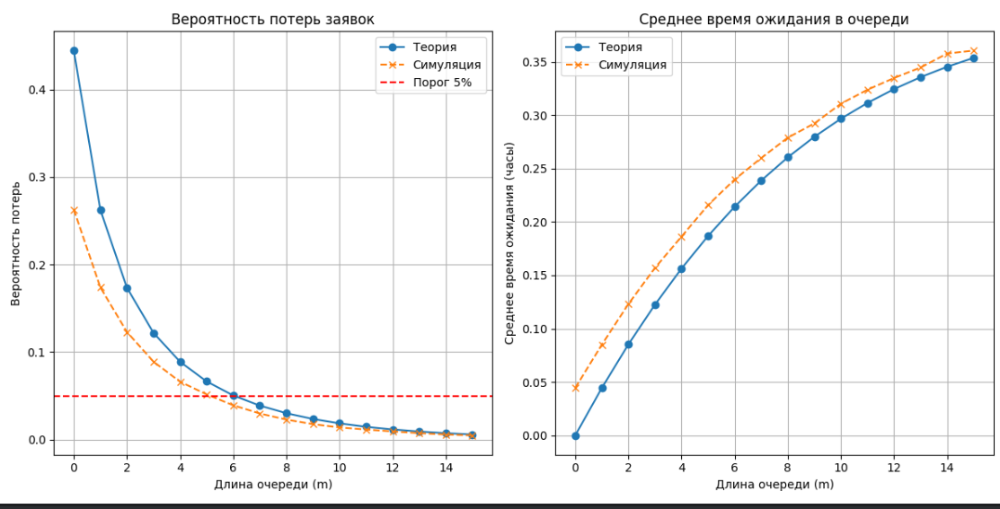

Цель работы:
Исследовать характеристики системы массового обслуживания с ограниченной очередью (M/M/1/m) и определить оптимальные параметры системы для минимизации потерь заявок и времени ожидания.

Задачи:
Разработать математическую модель системы с ограниченной очередью.
Провести расчеты основных характеристик системы.
Определить оптимальную длину очереди, при которой вероятность потерь не превышает заданного порога.
Проанализировать влияние параметров системы на ее эффективность.

Исходные данные:
Интенсивность входящего потока заявок (λ): задается вариантом (например, 8 заявок/час).
Интенсивность обслуживания (μ): задается вариантом (например, 10 заявок/час).
Максимальная длина очереди (m): задается вариантом (например, 5 заявок).
Порог вероятности потерь: не более 5%.

Шаги выполнения работы:
Разработка модели:
Опишите систему массового обслуживания с ограниченной очередью (M/M/1/m).
Учтите, что заявки, поступающие в систему, теряются, если очередь заполнена.
Расчет характеристик системы:
Рассчитайте следующие показатели:
Вероятность потери заявок (вероятность того, что очередь заполнена).
Среднее число заявок в очереди.
Среднее время ожидания заявки в очереди.
Среднее время пребывания заявки в системе.
Коэффициент загрузки системы.
Оптимизация длины очереди:
Проведите расчеты для различных значений длины очереди (m).
Определите оптимальную длину очереди, при которой вероятность потерь не превышает 5%.
Анализ результатов:
Постройте графики зависимости вероятности потерь и среднего времени ожидания от длины очереди.
Сделайте выводы о влиянии длины очереди на эффективность системы.

Требования к отчету:
Описание модели:
Краткое описание системы и ее параметров.
Формулы, используемые для расчетов.
Результаты расчетов:
Таблицы с рассчитанными характеристиками системы.
Графики зависимостей характеристик от длины очереди.
Анализ результатов:
Выводы о работе системы и рекомендации по выбору оптимальной длины очереди.

Инструменты для выполнения работы:
Язык программирования: Python (библиотеки numpy, scipy, matplotlib).
Программное обеспечение: Excel, MATLAB (по выбору).

m | P_loss (теория) | P_loss (симуляция) | Wq (теория) | Wq (симуляция)
 0 |     0.4444      |      0.2628       |   0.0000    |    0.0445   
 1 |     0.2623      |      0.1738       |   0.0444    |    0.0850   
 2 |     0.1734      |      0.1229       |   0.0852    |    0.1230   
 3 |     0.1218      |      0.0889       |   0.1225    |    0.1569   
 4 |     0.0888      |      0.0660       |   0.1563    |    0.1862   
 5 |     0.0663      |      0.0516       |   0.1868    |    0.2157   
 6 |     0.0504      |      0.0391       |   0.2142    |    0.2397   
 7 |     0.0388      |      0.0297       |   0.2387    |    0.2598   
 8 |     0.0301      |      0.0228       |   0.2605    |    0.2789   
 9 |     0.0235      |      0.0176       |   0.2797    |    0.2922   
10 |     0.0184      |      0.0138       |   0.2966    |    0.3107   
11 |     0.0145      |      0.0114       |   0.3115    |    0.3238   
12 |     0.0115      |      0.0092       |   0.3244    |    0.3348   
13 |     0.0091      |      0.0073       |   0.3356    |    0.3446   
14 |     0.0072      |      0.0057       |   0.3453    |    0.3577   
15 |     0.0058      |      0.0046       |   0.3537    |    0.3605   

Оптимальная длина очереди (теория): m=7
Оптимальная длина очереди (симуляция): m=6

