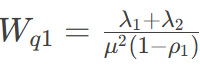
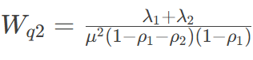
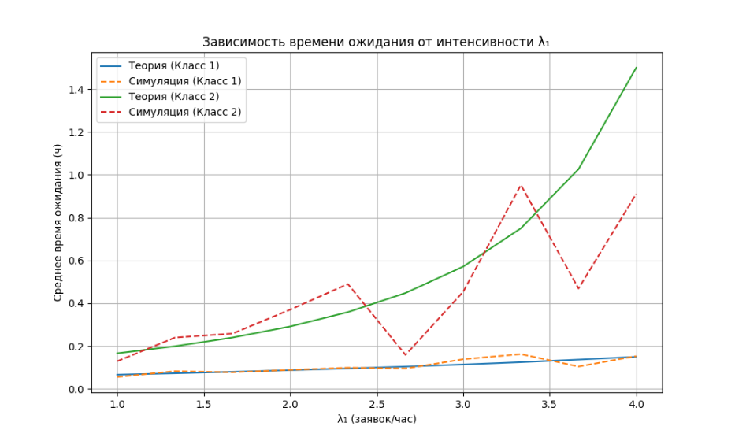
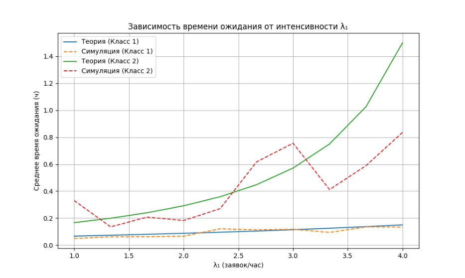
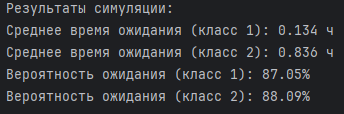
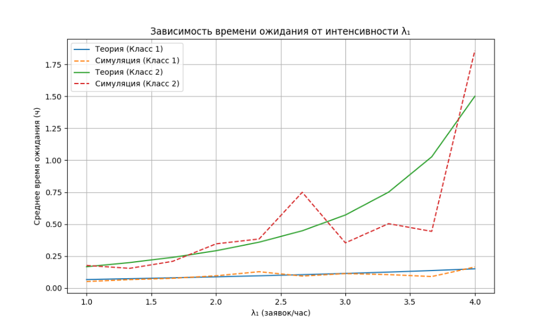
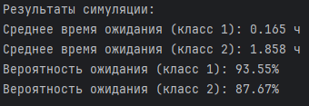
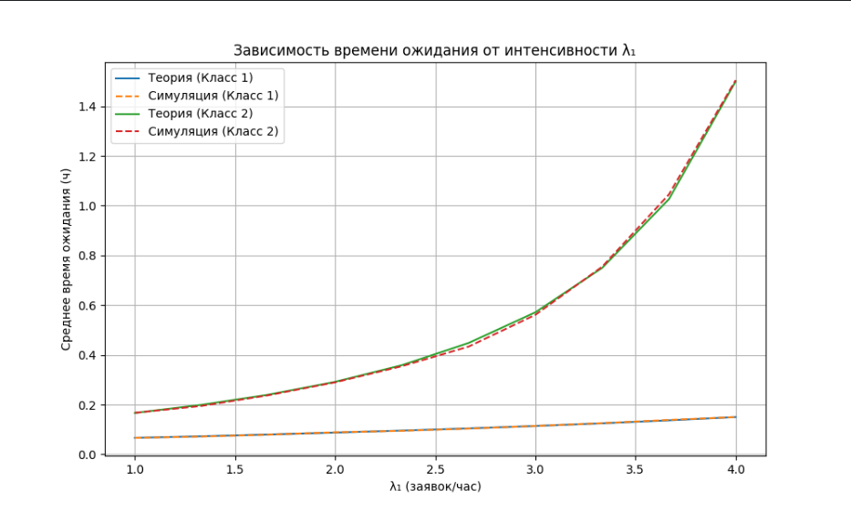
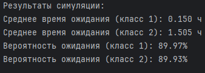

### Формулы:



### Результаты:






### Уменьшаем статистические шумы, увеличивая max events до 10^6


```
Таблица характеристик системы:
    λ₁  Wq1 (теория)  Wq1 (симуляция)  Вероятность ожидания 1 (теория)  Вероятность ожидания 1 (симуляция)  Wq2 (теория)  Wq2 (симуляция)  Вероятность ожидания 2 (теория)  Вероятность ожидания 2 (симуляция)
1.0000        0.0667           0.0669                           0.1000                              0.5993        0.1667           0.1680                           0.5556                              0.5963
1.3333        0.0731           0.0718                           0.1333                              0.6301        0.1993           0.1926                           0.5769                              0.6345
1.6667        0.0800           0.0818                           0.1667                              0.6707        0.2400           0.2486                           0.6000                              0.6747
2.0000        0.0875           0.0875                           0.2000                              0.7009        0.2917           0.3000                           0.6250                              0.7008
2.3333        0.0957           0.0965                           0.2333                              0.7402        0.3587           0.3541                           0.6522                              0.7329
2.6667        0.1045           0.1021                           0.2667                              0.7574        0.4481           0.4182                           0.6818                              0.7574
3.0000        0.1143           0.1117                           0.3000                              0.7907        0.5714           0.5693                           0.7143                              0.7947
3.3333        0.1250           0.1285                           0.3333                              0.8412        0.7500           0.7753                           0.7500                              0.8369
3.6667        0.1368           0.1378                           0.3667                              0.8628        1.0263           1.0101                           0.7895                              0.8598
4.0000        0.1500           0.1534                           0.4000                              0.8987        1.5000           1.5463                           0.8333                              0.8949`
```
